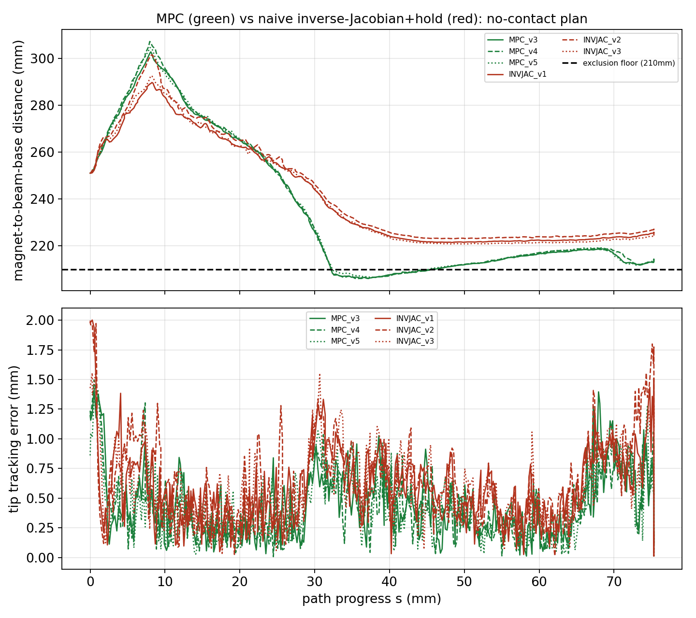

# MPC vs. Naive Inverse-Jacobian: Hard-Constraint Comparison

**Date:** 2026-10-07
**Plan:** `plans/vessel_phi30_L30_left1mm_newwall_tol0p5_nocontact_2026-10-06` (no-contact condition)
**Runs analysed:** 9 live closed-loop hardware runs (3 MPC, 3 naive inverse-Jacobian at gain 0.6, 3 at gain 1.0)

## Hypothesis under test

MPC enforces the magnet-exclusion-radius (210mm from the beam base) and magnet-z-workspace bounds directly inside its QP — the optimizer structurally cannot produce an infeasible solution. A naive resolved-rate (damped-pseudo-inverse) inverse-Jacobian controller has no equivalent machinery. Does that difference show up as the naive controller actually trying to violate the constraint, or does it show up some other way?

## Setup (kept identical across both controllers so the control law is the only variable)

- **Same Jacobian source.** Both controllers read the identical precomputed `(396, 3, 7)` schedule built by `run_mpc_delay_aware_vessel.py`'s `build_or_load_schedule` — the inverse-Jacobian controller runs in `naive_inverse_jacobian_ltv` mode (`--schedule-cache`), not a live per-tick evaluation. (A live-Jacobian mode was tried first and found too slow for 10Hz control — ~1-3s/call for an "accurate"-mode solve — causing the reference to outrun the robot; switching to the shared schedule fixed this and, as a side effect, makes the comparison cleaner since the Jacobian source is now provably identical between conditions.)
- **Same hard constraints.** 210.0mm magnet-exclusion floor (matching the plan's own design JSON), magnet-z-workspace bounds derived the same way in both scripts.
- **Null-space-inert inverse-Jacobian.** `nullspace_gain=0.0` (matches MPC's `Q_N=0`) *and* `feedforward=False` — the latter was a separate fix, since `InverseJacobianBeamController` still injects the offline plan's recorded velocity through the null-space projector when `feedforward=True`, even with `nullspace_gain=0`. With both off, the command is a pure task-space (minimum-norm) solution; verified directly that varying the reference posture/velocity produces a bit-identical command.
- **Constraint protection mode: `hold`.** The inverse-Jacobian controller's own math stays completely unaware of the exclusion/z-workspace constraints (no internal clip). A separate external gate (`close_loop_path_follow._COMMAND_SAFETY_GATE`) checks each raw command before it reaches the robot and holds position (zero command) if it would violate — logged as `magnet_gate_held`. This was chosen over the alternative "clip" mode (anticipatory projection, controller "handles" the constraint and keeps moving) specifically because it doesn't let the naive controller look smarter than it is — a held tick is a visible stall, not a quiet correction.
- **MPC config:** `mpc_delay_aware`, exact `Q_N=0`, `R=700·R0`, `d=2`, `beta_d=1`, horizon `N=15`, `V_f=0`.
- **Inverse-Jacobian gains tested:** `position_gain ∈ {0.6, 1.0}`, `damping=0.05` (fixed), `selective_damping_gain=0.0`.

## Results

| Run | Controller | `position_gain` | stop_reason | mean tip err (mm) | max tip err (mm) | min magnet dist (mm) | max magnet dist (mm) | gate holds |
|---|---|---|---|---|---|---|---|---|
| MPC v3 | MPC | — | path_complete | 0.421 | 1.425 | 206.04 | 302.86 | n/a |
| MPC v4 | MPC | — | path_complete | 0.406 | 1.497 | 205.98 | 307.30 | n/a |
| MPC v5 | MPC | — | path_complete | 0.418 | 1.408 | 206.52 | 304.67 | n/a |
| InvJac g0.6 v1 | naive (hold) | 0.6 | path_complete | 0.579 | 2.001 | 221.42 | 289.78 | 0/411 |
| InvJac g0.6 v2 | naive (hold) | 0.6 | path_complete | 0.639 | 1.996 | 223.10 | 301.59 | 0/412 |
| InvJac g0.6 v3 | naive (hold) | 0.6 | path_complete | 0.574 | 1.578 | 220.81 | 292.65 | 0/411 |
| InvJac g1.0 v1 | naive (hold) | 1.0 | path_complete | 0.783 | 4.728 | 231.56 | 302.23 | 0/412 |
| InvJac g1.0 v2 | naive (hold) | 1.0 | path_complete | 0.839 | 5.161 | 224.35 | 297.34 | 0/412 |
| InvJac g1.0 v3 | naive (hold) | 1.0 | path_complete | 0.836 | 4.572 | 228.24 | 302.86 | 0/411 |

All 9 runs completed the full path (`path_complete`). The exclusion floor is 210mm; no run — MPC or naive, either gain — ever crossed it, and the hold gate never fired once across any of the 6 inverse-Jacobian runs.

*Top: magnet-to-beam-base distance vs. path progress, MPC (green, 3 reps) vs. naive inverse-Jacobian at gain 0.6 (red, 3 reps), exclusion floor dashed. Bottom: tip tracking error over the same axis.*

## Findings

**1. Neither controller violates the constraint on this plan — the simplest version of the hypothesis is not confirmed.** The naive controller's raw (unaware) commands never actually tried to enter the excluded region, at either gain tested. This is itself informative: it means the no-contact plan's own geometry doesn't force a configuration close enough to the beam base to expose the difference as a violation.

**2. But there is a clear, repeatable (3/3 both conditions, tightly clustered across reps) structural difference: MPC actively rides the constraint boundary; the naive controller does not.** MPC's minimum magnet distance sits at 206.0–206.5mm — only ~4-5mm of margin above the 210mm floor — for an extended stretch of the path (s≈28–45mm, visible as the green trace pinned near the dashed line in the figure). The naive controller never gets closer than 220.8mm (gain 0.6) or 224.3mm (gain 1.0) — 11–22mm of unused margin throughout.

**3. That extra margin correlates with worse tracking, not better safety.** MPC's mean tip error (0.41–0.42mm) is consistently lower than the naive controller's (0.57–0.64mm at gain 0.6). The interpretation: MPC's explicit knowledge of the constraint lets it use the *full* available redundant-DOF space, right up to the edge, to better satisfy the tracking objective. The naive controller, with zero constraint awareness and a null-space-inert (minimum-norm) redundancy resolution, defaults to a conservative solution that happens to stay well clear of the boundary — not because it understands the constraint, but because minimum-joint-velocity-norm is itself a conservative strategy in this geometry. MPC's "understanding" of the constraint shows up as *better exploitation of the space*, not as *the naive controller failing*.

**4. Raising `position_gain` 0.6→1.0 did not move the naive controller closer to the exclusion boundary, and made tracking measurably worse.** Minimum magnet distance actually increased slightly (224–232mm). Mean tip error rose to 0.78–0.84mm and max tip error roughly tripled (4.6–5.2mm vs 1.6–2.0mm). The worst ticks in all three gain-1.0 runs land in the same narrow window, s≈22–26mm (ref_index 119–133) — just before the s≈28.5mm region this project has repeatedly identified as a geometrically demanding transition (where MPC's own magnet-distance trend also bends sharply, see figure). The per-tick error trace in that window oscillates (3.97→4.50→4.39→3.26→1.45→2.05→4.29→5.16→4.91→...mm) rather than showing one spike — the signature of underdamped ringing: `damping=0.05` wasn't raised alongside `position_gain`, so the more aggressive correction overshoots and rings in a region where the local Jacobian conditioning is less favourable.

## Caveats and scope

- **No-contact plan only.** The contact plan — where this project has independently established that the required configuration trajectory diverges much more sharply from the simpler case — has not yet been run through this comparison. It is the more likely place to actually see the naive controller's raw commands threaten the exclusion radius and the hold gate engage.
- **Two gain values only**, with damping held fixed. The gain-1.0 degradation may be partly or wholly fixable by co-tuning damping; this has not been tested.
- **`hold` mode only.** `clip` mode (anticipatory projection) and `off` mode (no protection at all, not recommended live) would show different pictures of the same underlying raw-command behaviour and have not been compared here.
- All comparisons are per-run (3 reps per condition), not per-tick-sample statistics, consistent with treating the run as the experimental unit.

## Suggested next steps

1. Repeat this exact comparison on the **contact** plan — the stronger test of the original hypothesis.
2. If pursuing higher gains further, raise `damping` alongside `position_gain` rather than gain alone, and check whether that removes the s≈22–26mm oscillation without sacrificing the tracking-accuracy gain a higher gain is meant to buy.
3. Consider a `--magnet-protection off` run (no gate at all) to directly observe whether the raw, fully unconstrained naive command would have entered the exclusion zone on the contact plan — this gives the *magnitude* of the near-miss that `hold` mode currently only reports as a binary (held / not held).
