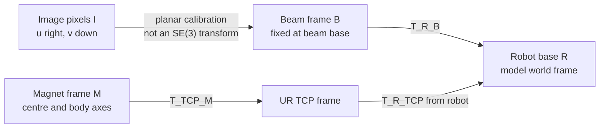

# Robotics frames, camera measurements, and model comparison

This guide explains the architecture used by
`robotics_frame_measurement_validation.py` and how to migrate the controller to
the same conventions. The central rule is simple:

> Convert every sensor and hardware quantity into a named physical frame once,
> then compare and control only quantities expressed in the same frame.

The validation script is read-only. It never calls the robot motion function.
It has not been tested against the physical robot or camera in this workspace.

## 1. The frame graph



The measured beam goes through `I → B → R`. The source magnet goes through
`M → TCP → R`. The forward model is built in `R`. Measured and simulated tips,
tangents, centreline points, lumen geometry, targets, and Jacobian rows can
therefore be compared in `R` without extra sign changes.

## 2. Transform notation

The script uses the robotics convention

\[
T^A_B \equiv T_{A\_B},
\]

where `T_A_B` maps a point expressed in frame `B` into frame `A`:

\[
\begin{bmatrix}p_A\\1\end{bmatrix}
=
T^A_B
\begin{bmatrix}p_B\\1\end{bmatrix}.
\]

For a direction vector, translation is not applied:

\[
v_A = R^A_B v_B.
\]

Transforms compose from right to left:

\[
T^R_M = T^R_{TCP} T^{TCP}_M.
\]

The `FrameTransform` class stores the parent and child names, checks that the
rotation is orthogonal and right-handed, and refuses incompatible composition.
This catches mistakes such as multiplying `T_R_B` directly by `T_TCP_M`.

### Point versus direction

This distinction is essential:

- Tip position is a point, so use rotation and translation.
- Tip tangent is a direction, so use rotation only.
- A magnet body axis and magnetic dipole are directions.
- A source-magnet centre is a point.

## 3. Why pixels are not another rigid frame

An image pixel `[u, v]` is a two-dimensional projective measurement. It is not
a three-dimensional Cartesian coordinate and should not be placed in a 4×4
rigid transform by adding `z=0` without a camera calibration model.

The script isolates this conversion in `PlanarPixelCalibration`:

\[
\lambda
\begin{bmatrix}x_B\\y_B\\1\end{bmatrix}
=
H^{B_{xy}}_I
\begin{bmatrix}u\\v\\1\end{bmatrix}.
\]

It supports two modes:

1. `basis_scale`: a fixed pixel origin, two fixed axis directions, and one
   metres-per-pixel scale. This reproduces the intended convention in the
   current data while centralising all flips and signs.
2. `homography`: a calibrated 3×3 mapping from the image to the physical beam
   plane. This is the preferred next step if there is noticeable perspective.

The same calibration object converts:

- the base, tangent, and tip markers;
- every measured centreline point;
- both lumen walls;
- model points back into the image for the overlay.

There are no downstream `-x`, `-y`, or image-y flips.

### Current legacy axis adapter

The saved `ex_img` and `ey_img` values appear to be stored in image-Cartesian
coordinates: x points right and y points up. The image array itself uses pixel
coordinates: u points right and v points down. The default configuration says
this explicitly:

```python
saved_axis_convention = "image_cartesian"
saved_axis_signs_for_positive_beam_xy = (-1.0, +1.0)
```

Those signs reproduce the intended legacy mapping:

\[
x_B=-[\Delta u,-\Delta v]\cdot e_x,
\qquad
y_B=+[\Delta u,-\Delta v]\cdot e_y.
\]

This conversion happens once when the calibration object is constructed. When
you later save pixel directions that directly indicate positive `B.x` and
positive `B.y`, change the convention to `pixel_uv` and use signs `(1, 1)`.

## 4. Problems in the current measurement code

The main errors are architectural rather than mathematical complexity.

| Current pattern | Why it is risky | Replacement |
|---|---|---|
| `base_px = (309, 330)` overwrites the detected base | The measurement can look stable even when detection or registration is wrong | Keep the detected base and compare it with the fixed calibrated origin as a residual |
| A frame is fitted again from moving beam markers | The coordinate system moves with the object being measured, hiding real motion | Calibrate one fixed frame from a straight/reference image and reuse it for the full experiment |
| Some functions flip image y and others do not | The meaning of `ex_ref` and `ey_ref` changes between functions | Convert the stored convention once inside `PlanarPixelCalibration` |
| Tip position is negated but the tangent is not | Position and direction describe different physical beam orientations | Map the tangent endpoints with the same camera mapping, then subtract |
| Lumen x/y signs are changed separately | Beam and lumen can occupy mirrored model frames | Convert lumen walls through the same calibration object as the beam |
| `z_offset_m` is passed to an external helper | Its sign and the frame in which it acts are not visible at the use site | Represent the complete physical tool offset as `T_TCP_M` |
| The camera origin and detected base are treated as the same value | Calibration error cannot be observed | Keep them separate and log `detected_base_B_m` |
| The robot pose is read only after vision work | A moving system can compare asynchronous states | Read the pose before and after capture, use the midpoint, and reject excessive drift |
| Nearest-neighbour marker ordering is accepted silently | A missed or false marker can swap identities | Keep the pivot hint, log the ordered markers, and add temporal identity tracking before live control |

There is also a display-flow error in the pasted `measure_tip_state_4markers`:
the drawing code for markers and axes is under `elif roi_box is not None`, so it
does not run when a polygon ROI is used. This does not change the measurements,
but it can make debugging misleading.

## 5. Standard data flow for one measurement cycle

The validation script performs the following sequence:

1. Validate all configuration, including `T_TCP_M`, before connecting to the
   robot.
2. Read `T_R_TCP` immediately before camera capture.
3. Capture one stationary image.
4. Read `T_R_TCP` immediately after capture.
5. Measure robot translation and rotation drift during the camera operation.
6. Use the midpoint TCP pose as the timestamp-aligned pose estimate.
7. Compose `T_R_M = T_R_TCP @ T_TCP_M`.
8. Detect the markers. The detected base is retained; it is not overwritten.
9. Convert all beam points from pixels to `B`, then from `B` to `R`.
10. Convert both lumen boundaries by the same route and build the forward model
    with the lumen centreline already expressed in `R`.
11. Form the model state from `T_R_M`:

    ```text
    p8 = [source_xyz_R, quaternion_wxyz_R_M, insertion_length]
    p7 = [source_xyz_R, rotation_vector_R_M, insertion_length]
    ```

12. Commit the nominal model solve at that exact source state.
13. Compare measured and model tips, tangents, and resampled centrelines in `R`.
14. Save the image overlay, a four-panel validation plot, a JSON summary, and a
    point-by-point CSV.

## 6. The physically important configuration

### `T_R_B`: beam frame in the robot base

`T_robot_beam_pose6` defines the fixed base of the simulated beam. Its
translation should be the physical beam pivot. Its rotation columns define the
positive `B.x`, `B.y`, and `B.z` axes expressed in `R`.

The camera calibration and the model must describe this same physical frame:

- the calibrated image origin should be the image of the beam pivot;
- the positive camera-plane axes must correspond to positive `B.x` and `B.y`;
- the model base pose must be `T_R_B`.

The script reports the distance between the detected base marker and the fixed
origin. Do not force this value to zero in code; use it to evaluate calibration.

### `T_TCP_M`: source magnet in the robot tool

The UR reports the TCP, not necessarily the magnet centre. `T_TCP_M` contains:

- the vector from TCP origin to magnet centre, expressed in TCP coordinates;
- the orientation of the magnet body axes relative to the TCP axes.

The current files do not establish whether `z_offset_m=0.27` means TCP +Z,
robot-base +Z, or the opposite direction. The new script therefore does not use
that scalar and does not guess. It fails before hardware access until one of
these is true:

```python
T_tcp_magnet_pose6 = (x_m, y_m, z_m, rx_rad, ry_rad, rz_rad)
```

or, only when physically true:

```python
assume_tcp_is_magnet_frame = True
```

Do not simply copy `0.27` into the z component until its direction and frame
have been verified. If it is truly a fixed translation along TCP +Z with no
axis rotation, then the explicit equivalent is `(0, 0, 0.27, 0, 0, 0)`.

### Source magnetic moment axis

`T_R_M` describes the magnet body axes. The model's `m_body` is expressed in
`M`. The physical dipole shown in the robot plot is

\[
m_R = R^R_M m_M.
\]

Confirm which face of the real source magnet is magnetic north and that the
configured body moment points in that direction. A correct magnet centre with a
180° body-axis error can produce a plausible-looking position and a completely
wrong field.

## 7. Camera calibration best practice

The current two-point millimetres-per-pixel calculation is acceptable only when
all of the following are approximately true:

- the beam motion is planar;
- the beam plane is nearly parallel to the image sensor;
- the camera is sufficiently far away to be approximately orthographic;
- lens distortion is negligible in the region of interest;
- the reference distance lies in the same physical plane as the beam.

For a more reliable calibration:

1. Calibrate camera intrinsics and lens distortion using a checkerboard or
   ChArUco board.
2. Undistort the image before creating any saved ROI, marker reference, or
   lumen boundary. All saved pixel data must refer to the same image domain.
3. Place at least four non-collinear metric points in the beam plane.
4. Estimate `H_Bxy_I` with RANSAC and record the reprojection residual for each
   calibration point.
5. Validate on additional points that were not used to fit the homography.
6. Paste the resulting metre-valued homography into
   `homography_pixel_to_beam_xy_m` and select `camera_calibration_mode =
   "homography"`.

A single camera cannot measure out-of-plane beam motion. The script explicitly
sets camera-derived `B.z=0`. If meaningful out-of-plane bending is possible,
use stereo vision, multiple calibrated views, depth sensing, or a constrained
physical model with an independently verified planar-motion assumption.

## 8. Hardware and timing best practice

The camera and UR measurements should represent the same physical instant. The
read-before/read-after midpoint used here is a stationary validation method, not
full synchronization. For moving closed-loop experiments:

- use hardware timestamps when the camera and robot interfaces provide them;
- buffer robot poses and interpolate `T_R_TCP` at the image exposure time;
- record exposure time, pose time, processing completion time, and command time;
- reject frames whose timestamp uncertainty exceeds the controller budget;
- never compare a new camera frame against a source pose from the preceding
  command.

Run the stationary script first. The two robot drift checks should pass before
you treat the resulting model residual as a calibration or theory error.

## 9. Controller and Jacobian frame rules

For the first translation-only controller, keep both the model output and
source translation state in `R`:

\[
e_R = p^{target}_R-p^{tip}_R,
\]

\[
\Delta q_R = K_p J_R^T
\left(J_RJ_R^T+\lambda^2I\right)^{-1}e_R.
\]

Here `J_R` must mean

\[
J_R = \frac{\partial p^{tip}_R}{\partial p^{magnet}_R}.
\]

That matches the first three translation columns of the forward model's p7
state. Do not pass a `B`-frame error into an `R`-frame Jacobian.

If you want to express only the output error in `B`, rotate the output rows:

\[
e_B=R^B_R e_R,
\qquad
J_{B\leftarrow R}=R^B_RJ_R.
\]

If both the output and input translation increments are expressed in `B`, use

\[
J_B=R^B_RJ_RR^R_B.
\]

When rotation columns are enabled later, do not treat rotation-vector
components as globally additive Cartesian coordinates. Define whether the
rotation perturbation is a body or spatial tangent and transform the full twist
with the SE(3) adjoint. The analytic Jacobian and finite differences must use
the same tangent convention.

### Converting a desired magnet pose to a robot TCP command

The controller reasons about the magnet pose `T_R_M`, but the robot accepts a
TCP pose. Convert back through the calibrated tool transform:

\[
T^R_{TCP,desired}=T^R_{M,desired}\left(T^{TCP}_M\right)^{-1}.
\]

For the current translation-only controller with fixed orientation, a small
translation of the magnet centre produces the same small translation of the
TCP. Once rotations are commanded, the full equation is required because the
magnet centre moves around the TCP lever arm.

## 10. Recommended code organisation

Keep the responsibilities separate even if they initially live in one file:

| Layer | Responsibility | Must not do |
|---|---|---|
| `frames` | Named SE(3) transforms, composition, inversion, adjoints | Read hardware or pixels |
| `camera_calibration` | Pixel ↔ beam-plane mapping and calibration diagnostics | Know robot pose or model internals |
| `perception` | Marker identity, centreline extraction, confidence | Apply robot transforms or model signs |
| `hardware_adapter` | Timestamped `T_R_TCP`, camera frames, safe robot commands | Contain model-specific offsets |
| `model_adapter` | `T_R_M → p7/p8`, nominal solve, Jacobians | Interpret raw pixels |
| `experiment` | Sequence acquisition, compare, log, enforce safety gates | Reimplement geometry |

The supplied script keeps these as clearly separated sections so they can be
moved into modules later without changing the maths.

## 11. Reading the validation outputs

Each run creates:

- `camera_overlay.png`: measured centreline, projected model centreline, lumen
  walls, fixed positive `B` axes, markers, and source projection;
- `frame_validation.png`: camera view, beam-frame comparison, robot-frame 3D
  geometry with source-magnet box/body axes/dipole, and residual versus
  arclength;
- `frame_validation_summary.json`: all transforms, raw robot poses, p7/p8,
  calibration matrix, composite properties, measurements, metrics, and checks;
- `comparison_points.csv`: corresponding measured/model points in both `R` and
  `B`.

Interpret failures in this order:

1. **Robot stationary checks fail:** the image and source pose do not represent
   one state. Fix timing or prevent motion first.
2. **Camera round trip fails:** the calibration implementation or matrix is
   invalid.
3. **Detected base error is large:** image origin, marker identity, or `B` frame
   registration is wrong.
4. **Overlay is mirrored or axes point the wrong way:** fix the calibration
   axis convention/signs. Do not compensate in the model or controller.
5. **Source box/axes are wrong in 3D:** fix `T_TCP_M` or the robot pose
   interpretation.
6. **Geometry is aligned but model residual remains:** investigate beam
   stiffness, distributed magnetisation, source moment, insertion length,
   contact parameters, or unmodelled out-of-plane deformation.

## 12. Physical verification checklist

Before any live controller motion, verify and record:

- [ ] UR pose6 is `T_R_TCP` with translation in metres and rotation vector in
  radians.
- [ ] `T_R_B` origin is the physical beam pivot.
- [ ] `T_R_B` axes match the model's base quaternion and beam-growth direction.
- [ ] Camera images and saved points are either all raw or all undistorted.
- [ ] Pixel origin is the image of the physical beam pivot.
- [ ] Positive `B.x` and `B.y` arrows in the camera overlay are physically
  correct.
- [ ] Millimetres-per-pixel or homography error is measured across the whole
  working region.
- [ ] `T_TCP_M` translation locates the magnet centre, not a flange or TCP
  point.
- [ ] `T_TCP_M` rotation matches the model magnet body axes.
- [ ] The plotted dipole arrow matches the real magnetic north direction.
- [ ] Source position from `T_R_M` agrees with an independent physical
  measurement.
- [ ] The beam is planar enough for `B.z=0`, or a 3D vision method is used.
- [ ] Camera/robot time offset and jitter are below the required control period.
- [ ] Analytic and finite-difference Jacobians use the same frames, units, and
  perturbation convention.
- [ ] Workspace, step-size, condition-number, prediction, and disagreement
  gates pass before commands are enabled.

## 13. Suggested migration sequence

1. Fill in and physically verify `T_TCP_M`.
2. Run the stationary validation script without changing the controller.
3. Correct only calibration and transform definitions until the overlays and
   base/source checks are correct.
4. Collect repeated stationary frames to measure vision noise and marker
   identity reliability.
5. Move the standard `FrameTransform`, camera calibration, and measurement
   functions into the hardware experiment.
6. Replace the legacy `vision_result_to_x_meas_robot` path with the measured
   `tip_R_m` and `tangent_R` from this pipeline.
7. Replace the legacy scalar z-offset state conversion with
   `T_R_M = T_R_TCP @ T_TCP_M`, then form p7/p8 from `T_R_M`.
8. Run the arc experiment with motion disabled and inspect every planned pose.
9. Run a very small live arc, comparing measured displacement with the
   one-step Jacobian prediction.
10. Enable proportional inverse-Jacobian point control only after the frame,
    timing, and Jacobian consistency gates all pass.

